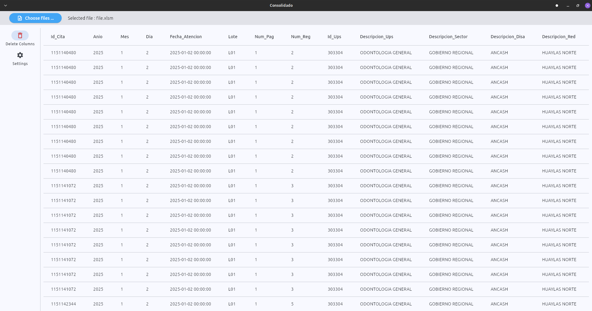

# 🩺 Patient Records Consolidator – Automation with Python & Flet

[**🇪🇸 Read this documentation in Spanish**](README.es.md)

Application developed in **Python** using the **Flet** framework to automate the review and visualization of patient data from Excel files (.xlsm, .xlsx) issued by the **Ministry of Health of Peru (MINSA)**.

The main goal is to reduce the time required for searching and analyzing records (over 10,000 entries) through a modern, fast, and cross-platform interface.

**Python** was chosen for its excellent data analysis capabilities through the **Pandas** framework, which allows efficient handling of large datasets.  

## ⚙️ Technical Challenges

One of the main challenges in this version was efficiently handling large datasets, which initially impacted performance.  
This issue was resolved by implementing **multithreading** and **async/await**, significantly improving load speed and responsiveness.

## 🚀 Current Features (v1.0)

- Loads and displays the **first 100 patient records**.  
- Clean and modern interface built with **Flet**.  
- Asynchronous data handling for faster performance with large Excel files.

## 🧭 Upcoming Improvements

- 🔄 **Pagination** to display the entire Excel file.  
- 🔍 **Search and filtering** by columns (ID, name, date, etc.).  
- 🧱 **Dynamic column removal** directly from the interface.

## 🛠️ Technologies Used

- [Python 3.11+](https://www.python.org)  
- [Flet](https://flet.dev)  
- [Pandas](https://pandas.pydata.org)  
- [OpenPyXL](https://openpyxl.readthedocs.io)  
- [Asyncio](https://docs.python.org/3/library/asyncio.html)

## 👨‍💻 Author

**Jhon Solano**  
[GitHub: @dhalcin](https://github.com/dhalcin)

> 🚧 Active development — first functional version (**v1.0**)  
> The goal is to evolve this tool into a complete application for clinical data analysis and management.
